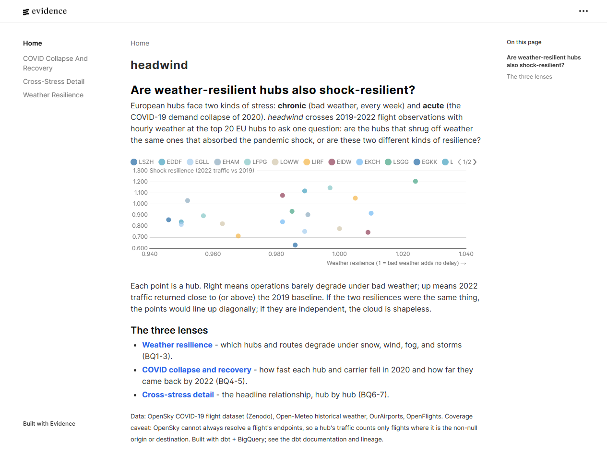
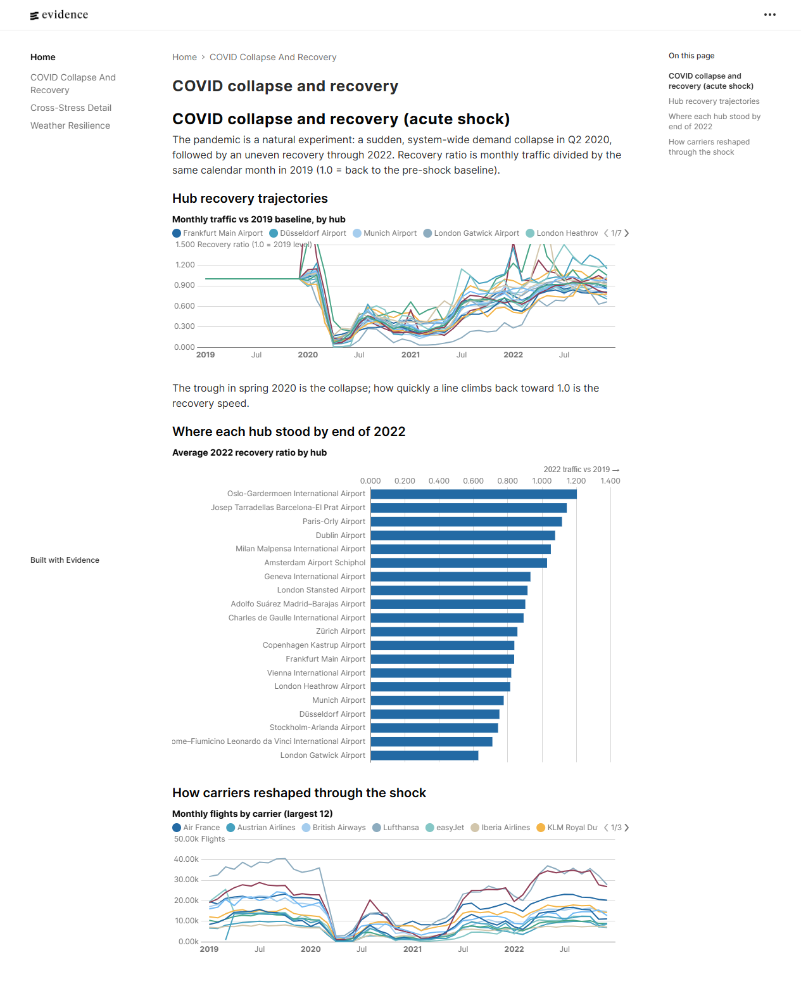
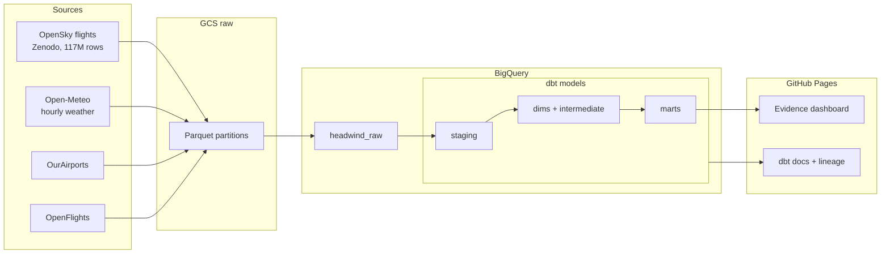

# headwind

**European aviation operational resilience analytics: dbt + BigQuery + weather + the COVID shock as a natural experiment.**

[**Live dashboard**](https://joacoferrer00.github.io/headwind/) · [**dbt docs + lineage**](https://joacoferrer00.github.io/headwind/dbt-docs/)

[](https://joacoferrer00.github.io/headwind/)

---

## The question

An EU hub is stressed in two ways: **chronic** (bad weather, every week) and **acute**
(a shock like the COVID-19 demand collapse of 2020). headwind crosses four years of
European flight data (2019-2022) with hourly weather at the top 20 EU hubs to ask the
headline question:

> **Are the hubs that shrug off weather the same ones that absorbed the pandemic shock,
> or are these two different kinds of resilience?**

## The finding

Across the 20 hubs, the correlation between **weather resilience** (how little flight
duration degrades under snow, wind, fog, and storms) and **shock resilience** (how close
2022 traffic returned to the 2019 baseline) is **about 0.30**. That is weak: operational
robustness to daily weather and structural recovery from a demand collapse are largely
**independent**. Knowing a hub handles weather well tells you little about how it weathered
the shock. Explore it on the [cross-stress page](https://joacoferrer00.github.io/headwind/cross-stress/).

The COVID-19 collapse and recovery is the visible payoff: a system-wide trough in Q2 2020
and an uneven climb back through 2022.

[](https://joacoferrer00.github.io/headwind/covid-recovery/)

## Architecture



Python ingestion lands raw Parquet in GCS and loads it to BigQuery. dbt transforms raw to
tested marts. GitHub Actions rebuilds and tests the whole pipeline on every PR, and
publishes the docs and dashboard to GitHub Pages. Auth to BigQuery is Workload Identity
Federation (no long-lived service-account key).

## The dbt project

Five layers, materialized in BigQuery and partitioned + clustered for cost:

- **staging** (5 models) cleans each source. `stg_opensky__flights` is the heavy one:
  117M rows, deduplicated, with millisecond timestamps and `callsign[:3]` as the airline.
- **dimensions** (6): airport (hub-flagged), airline, aircraft, date spine, weather event,
  pandemic phase.
- **intermediate** (2): `int_flights_with_weather` (13M hub-touching flights joined to
  hourly weather at origin and destination, the technical centerpiece) and
  `int_traffic_baselines` (the 2019 denominator for recovery).
- **marts** (4): hub resilience, hub recovery, route risk, airline performance.

**120 data tests** cover keys, referential integrity, enums, business rules (no landing
before takeoff, every hub has a 2019 baseline, weather joined within a day of the flight),
and dbt-expectations ranges. 117 pass, 3 warn by design, 0 errors.

## Data and the coverage caveat

| Source | Use |
|--------|-----|
| [OpenSky COVID-19 Flight Dataset](https://doi.org/10.5281/zenodo.3931948) (CC-BY) | flights |
| [Open-Meteo Historical Weather](https://open-meteo.com/en/docs/historical-weather-api) | weather |
| [OurAirports](https://ourairports.com/data/) | airport reference |
| [OpenFlights](https://openflights.org/data.html) | airline reference |

**Coverage caveat (the biggest data-quality fact):** OpenSky cannot always resolve a
flight's endpoints, so `origin` / `destination` are frequently null. A hub's traffic counts
only flights where it is the non-null origin or destination; flights null on the relevant
side are dropped. Airline is derived from the callsign prefix, and about 60% of observed
prefixes do not resolve to a known carrier. These are surfaced as warn-level tests, not
hidden.

## CI/CD

- **`ci.yml`** (on PR + dispatch): sqlfluff, `dbt deps`, `dbt build` + `dbt test` against a
  dedicated `dbt_ci` dataset, authenticated via Workload Identity Federation.
- **`pages.yml`** (on push to main): builds the Evidence dashboard and dbt docs and deploys
  both to GitHub Pages.

## Running locally

```bash
# Python env + dbt (BigQuery auth via gcloud ADC)
python -m venv .venv && . .venv/Scripts/activate
pip install -r requirements.txt
gcloud auth application-default login

cd headwind_dbt && dbt build      # build + test the pipeline

# Dashboard
cd ../evidence && npm install && npm run dev
```

Conventions for SQL and Python are in [CONVENTIONS.md](CONVENTIONS.md); full architecture
in [PIPELINE.md](PIPELINE.md); scope and the dimensional model in [PLANNING.md](PLANNING.md).

## Future work

- dbt **semantic layer** for the core metrics.
- **OWID COVID stringency** as a weighting source, to replace "2020 = one block" with how
  hard each country actually locked down.
- **SCD Type 2** on `dim_airport`.
- A live extension reading OpenSky's **Trino** endpoint for current flights, beyond the
  frozen 2019-2022 window.
